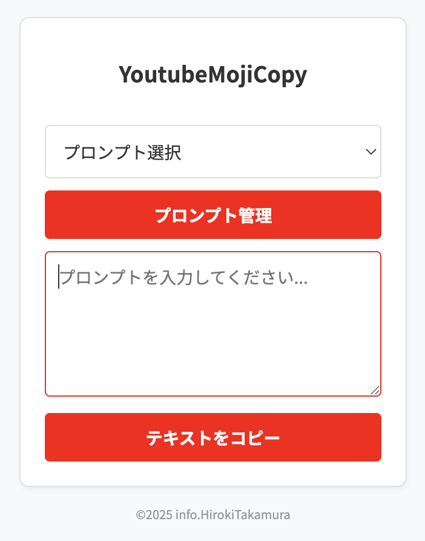
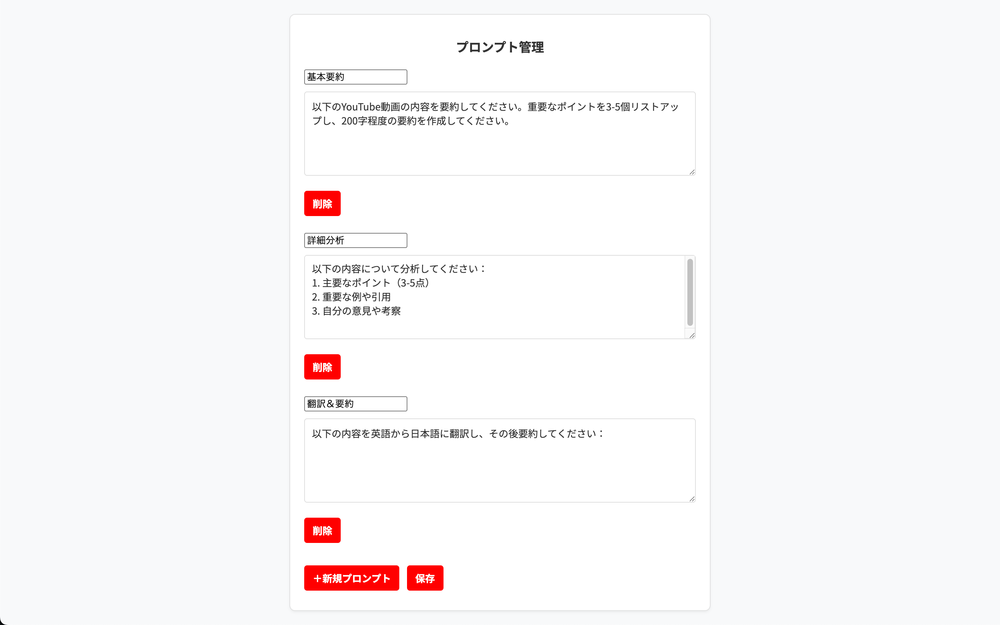

# YoutubeMojiCopy

YouTube動画の字幕を簡単にコピーしてAIチャットに活用できるChrome拡張機能

## 特徴

- YouTube動画の字幕を簡単にコピー
- 字幕取得から分析まで、ワンクリックで完結
- 日本語に特化したプロンプトテンプレート
- シンプルで使いやすいインターフェース

## インストール方法

1. Chrome Web Storeから「YoutubeMojiCopy」をインストール
2. YouTubeの動画ページを開く
3. 拡張機能のアイコンをクリック

## スクリーンショット

以下は拡張機能のサンプル画面です。

*動画ページ上でアイコンをクリックすると表示されるポップアップです。*

*オプションページでプロンプトを追加・編集・削除できます。*

## 使い方

1. YouTubeの動画ページを開く
2. 拡張機能のアイコンをクリック
3. プロンプトテンプレートを選択するか、独自のプロンプトを入力
4. 「テキストをコピー」ボタンをクリック
5. コピーされたテキストをChatGPT、Claude、Geminiなどのチャットサービスに貼り付け

## プロンプトテンプレート

拡張機能には以下の3つの基本テンプレートが用意されています：

1. **基本要約** - 動画内容の主要ポイントと要約を取得
2. **詳細分析** - より深い分析と考察を得るためのテンプレート
3. **翻訳＆要約** - 英語の字幕を日本語に翻訳し要約

もちろん、独自のプロンプトを作成して保存することも可能です。

## 特長

- **シンプルな操作** - 余計な機能を省いた直感的な操作性
- **マルチ言語対応** - 日本語・英語など、様々な言語の字幕に対応
- **テンプレート保存** - よく使うプロンプトを自動保存
- **軽量設計** - 最小限の機能でパフォーマンスを重視

## 注意事項

- YouTubeの仕様変更により動作しなくなる可能性があります
- 字幕が用意されていない動画では使用できません
- 自動生成字幕の精度は元の音声によって異なります

## ライセンス

MIT License

## 開発者

info.HirokiTakamura